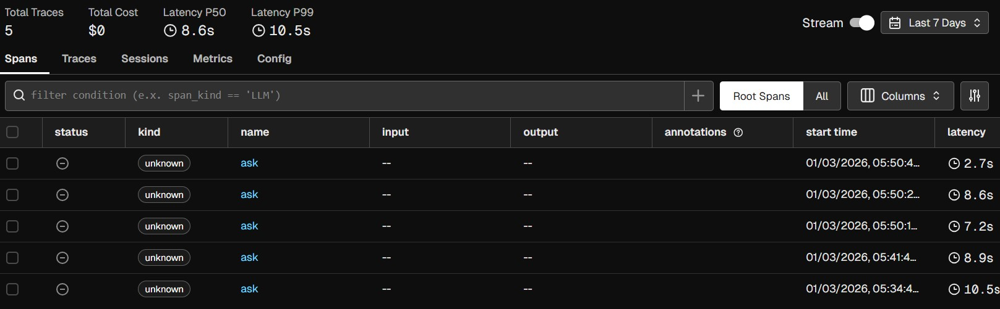
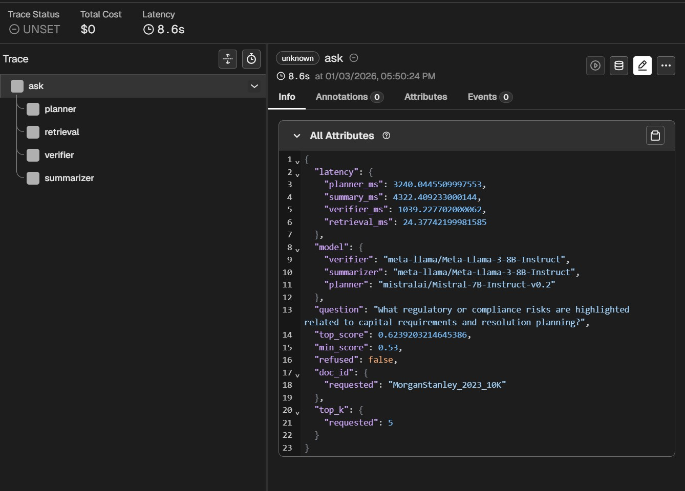
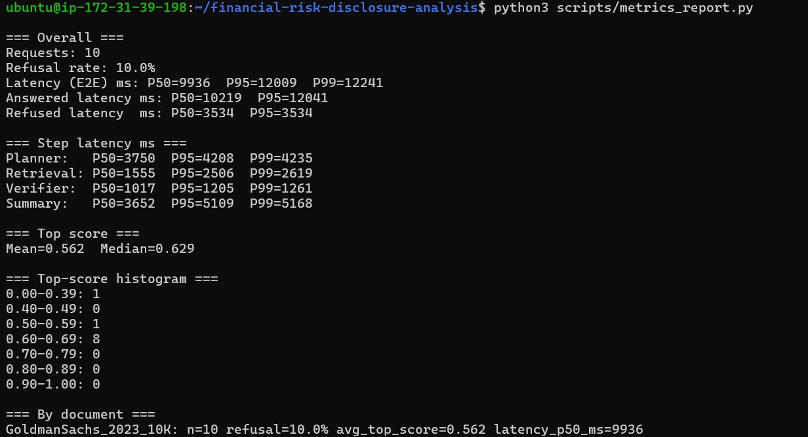
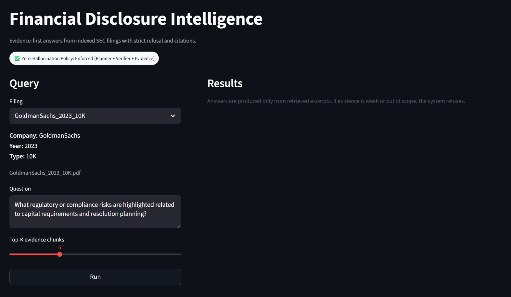
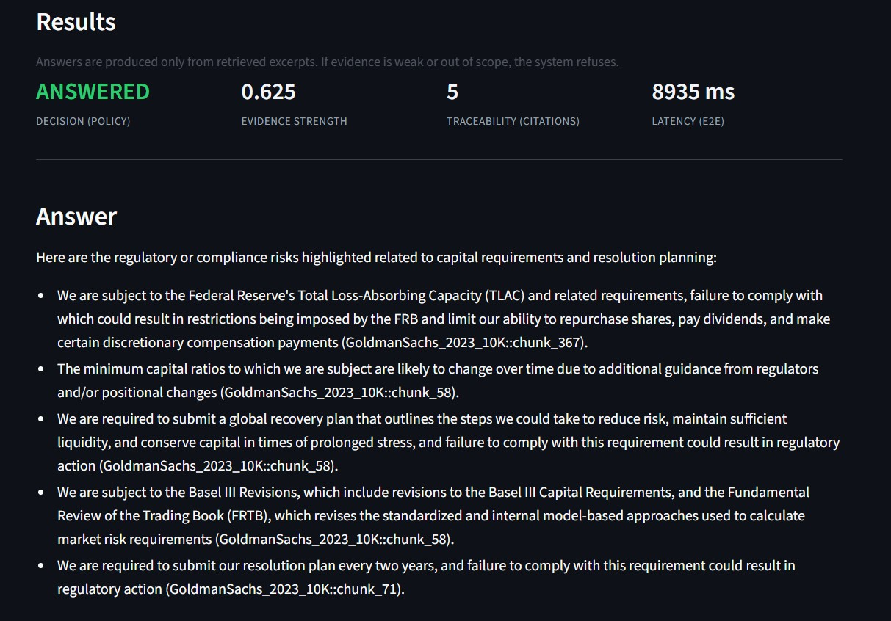
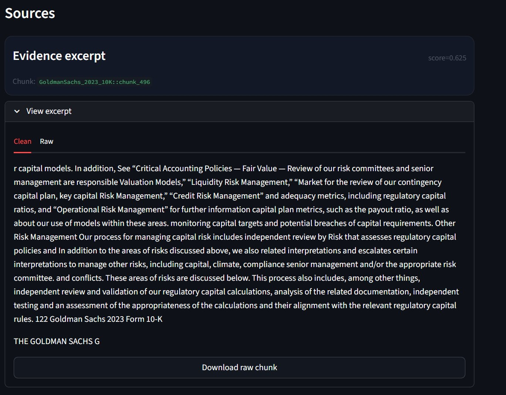
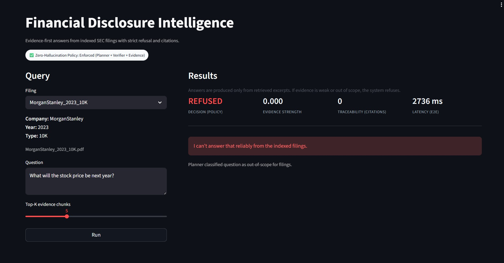
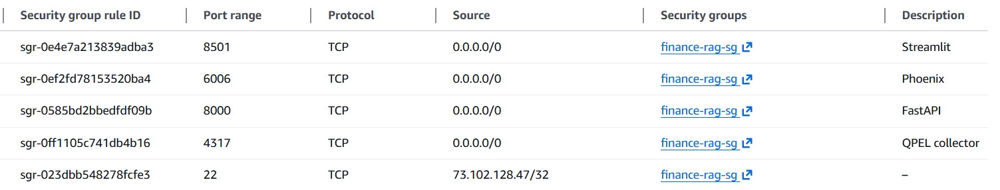

**Evidence-first financial intelligence over SEC filings.  
Every answer is cited or explicitly refused.**

---

# Financial Disclosure Intelligence  
### Zero-hallucination, multi-agent RAG system for SEC 10-K filings

Financial analysts, risk teams, and compliance professionals rely on long SEC filings (10-K) to assess regulatory exposure, capital constraints, and material risks. These documents are difficult to interrogate reliably using traditional search or generic LLMs.

This project implements a **production-style Retrieval-Augmented Generation (RAG) system** that answers analyst-style questions **only when sufficient evidence exists**, and **refuses** otherwise.

> **If the answer cannot be proven from filings, it must not be generated.**

---

## Core Guarantees

- Answers are grounded **only in retrieved SEC filing excerpts**
- Every answer includes **chunk-level citations**
- Out-of-scope or speculative questions are **refused by policy**
- Each decision is **observable, traceable, and testable**

This mirrors real financial and compliance systems.

---

## System Architecture (Multi-Agent RAG)

Each `/ask` request executes as a **fully traced workflow**:

### 1. Planner Agent (Mistral – Hugging Face)
- Classifies intent (in-scope vs out-of-scope)
- Rewrites the query for retrieval
- Dynamically selects evidence size (top-k)

Speculative questions (e.g., stock price predictions) are rejected early.

---

### 2. Retriever (FAISS)
- Embeds rewritten queries
- Performs semantic search over SEC filing chunks
- Returns top-k chunks with similarity scores

Retrieval latency is measured independently.

---

### 3. Verifier Agent (LLaMA – Hugging Face)
- Validates evidence sufficiency
- Refuses when similarity or coverage is inadequate
- Prevents semantic false positives

---

### 4. Summarizer Agent (LLaMA – Hugging Face)
- Produces concise bullet-point answers
- Uses **only retrieved evidence**
- Enforces citation per bullet `(doc_id::chunk_id)`
- Refuses if evidence is insufficient

---

## Zero-Hallucination Policy (Enforced)

The system guarantees **one of two outcomes**:

- ✔️ Grounded, cited answer  
- ❌ Explicit refusal with explanation

### Enforcement Layers
- Planner intent filtering  
- Retrieval confidence thresholds  
- Verifier evidence checks  
- Evidence-only summarization prompts  
- Unit tests asserting refusal behavior  

A dedicated test asserts that **stock-price predictions must be refused**.

---

## Observability and Monitoring

### Distributed Tracing (Arize Phoenix)

Each request generates:
- Root trace
- Child spans for:
  - planner
  - retrieval
  - verifier
  - summarizer

Phoenix exposes:
- End-to-end latency (P50 / P95 / P99)
- Per-stage latency breakdown
- Refusal stage attribution
- Evidence score distributions

**Screenshots**
- **Latency KPIs and system health**


- **End-to-end trace showing multi-agent execution**



---

### Runtime Metrics (From Production Logs)

Metrics are logged per request and summarized via `scripts/metrics_report.py`.

**Observed Metrics (Sample Run)**

- Requests: **10**
- Refusal rate: **10%**
- End-to-end latency:
  - P50: **9.9s**
  - P95: **12.0s**
  - P99: **12.2s**
- Mean retrieval similarity score: **0.56**
- Median retrieval similarity score: **0.63**

Latency by stage (P50):
- Planner: **3.7s**
- Retrieval: **1.6s**
- Verifier: **1.0s**
- Summarizer: **3.6s**

Screenshot:
- **Latency, refusal rate, and evidence score distribution**


---

## Frontend Decision KPIs (Streamlit)

The UI surfaces **decision-relevant KPIs**, not vanity metrics:

- Decision: ANSWERED or REFUSED
- Evidence strength (top similarity score)
- Citation count
- End-to-end latency

Screenshots:
- **Home dashboard**


- **Grounded answer with citations**



- **Explicit refusal when evidence is insufficient**


---

## Containerization and Deployment

The system is fully containerized using **Docker Compose**:

- `api`: FastAPI + FAISS + agents
- `ui`: Streamlit frontend
- `phoenix`: Observability backend

Deployment was validated on **AWS EC2**.

### Exposed Ports
- 22 – SSH
- 8000 – FastAPI
- 8501 – Streamlit UI
- 6006 – Phoenix UI

Screenshot:
- **Security group inbound rules (API, UI, tracing)**


---

## Dataset

Indexed filings:
- Goldman Sachs - 2023 Form 10-K
- JPMorgan Chase - 2023 Form 10-K
- Morgan Stanley - 2023 Form 10-K

Total evidence chunks: **3,834**

Stored in:
- `data/processed/chunks.jsonl`
- `data/processed/embeddings.faiss`

---

## Project Structure

- `api/` – FastAPI application
- `api/rag/` – Retrieval + agent logic
- `streamlit/` – Analyst-facing UI
- `data/raw/` – Raw SEC PDFs
- `data/processed/` – Chunks, embeddings, FAISS index
- `monitoring/` – Logs, metrics and traces
- `tests/` – Guardrail and refusal tests
- `assets/` – Screenshots and documentation
- `architecture.md` – Detailed system design
- `data_sources.md` – Filing scope and provenance

---

## Data Ingestion and Chunking

SEC filings (10-K) are ingested from PDF format and processed through a deterministic chunking pipeline. Each filing is extracted using `pdfplumber`, cleaned, and split into overlapping chunks for retrieval.

Each chunk stores:
- document identifier
- company name
- filing year and type
- deterministic chunk ID
- chunk text and length

---

## How to Run Locally

Install dependencies:
```bash
python -m pip install -r requirements.txt
 ```

Build chunks:
```bash
python -m scripts.build_chunks
```

Build embeddings + FAISS index:
```bash
python -m scripts.build_faiss_index
```

Start the API:
```bash
uvicorn api.main:app --reload
```

Sanity check:
- `GET /sources` should list the 3 filings
- a sample `/ask` should return citations and evidence chunks

Start Streamlit:
```bash
streamlit run streamlit/app.py
```
